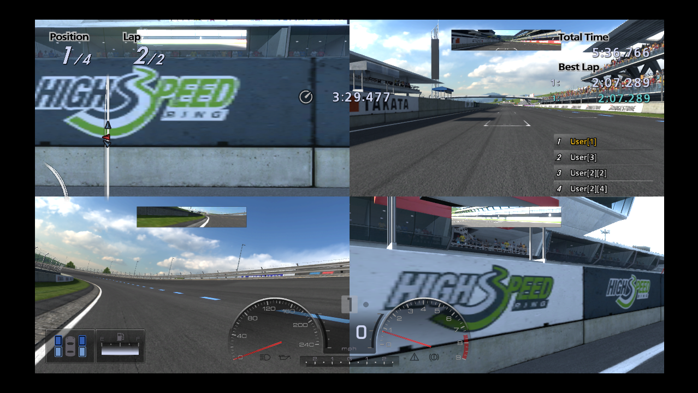

# Gran Turismo 5 — 3 and 4 player split screen

Reverse-engineering work that turns the two-player *2P Split Screen* arcade mode of
**Gran Turismo 5 (BCES00569, update 2.17)** into a three- or four-player race: three or four
viewports, three or four human-driven cars, on controller ports 1–4.

Verified on real hardware (PS3 with CFW, webMAN MOD) and in RPCS3 0.0.42.



## What this repository is, and is not

It contains **the patch, not the game**:

* the patch word list — every modified instruction with its address, the original word, the
  replacement, and the disassembly of both (`release/*/words.txt`, 288 words)
* the Adhoc script modifications as a diff against the public
  [OpenAdhoc](https://github.com/Nenkai/OpenAdhoc) sources, plus the scripts that apply them
* the PS3 installer (`installer/`) and the tooling used to find all of this
  (`tools/`, `doc/`)

It contains **no part of Gran Turismo 5**. No EBOOT, no disc data, no decryption keys. The
patched executable is built on your own machine, from your own copy of the game, by
`installer/build_pkg.sh`. Without that copy nothing here produces a runnable game.

## Building your own installer package

You need a PS3 with CFW or HEN, your own copy of GT5 with **update 2.17** installed, a
[ps3dev/PSL1GHT](https://github.com/ps3dev/ps3toolchain) toolchain, and `scetool` with a keys
file (neither is included).

```sh
# 1. copy your own EBOOT off the console
#    /dev_hdd0/game/BCES00569/USRDIR/EBOOT.BIN   (9505120 bytes)

# 2. build the script overlay once (needs .NET, GTAdhocToolchain, GTToolsSharp, OpenAdhoc)
tools/build_mod.sh mod_x                # MOD_WINDOW_MAX=3 for the 3P build

# 3. build the package
export PSL1GHT=/usr/local/ps3dev
installer/build_pkg.sh /path/to/your/EBOOT.BIN 4p
```

`build_pkg.sh` refuses to continue unless your EBOOT is the unmodified 2.17 one
(md5 `a8924d1f…`, decrypted sha1 `306f86c6…`), so you cannot accidentally patch the wrong
executable. It produces `installer/gt5-4p-installer.pkg`.

## Installing

Copy the package to `/dev_hdd0/packages/` on the console, install it from the package manager,
and run **GT5 4P Split Screen Installer** from the XMB. It

1. checks that the installed EBOOT really is the untouched 2.17 one and refuses otherwise,
2. keeps the original as `EBOOT.BIN.orig` and every replaced PDIPFS file as `<name>.orig`,
3. replaces `EBOOT.BIN` and copies the script overlay, then reads both back to verify.

Running it again offers to restore the original files.

In game: **Arcade → 2P Split Screen → track → cars**, then answer the extra
"player 3 / player 4 joins?" prompts with yes.

## RPCS3

`release/*/rpcs3-patch.yml` holds the same patch as an RPCS3 patch group — no EBOOT
modification needed there. Drop it into `~/.config/rpcs3/patches/patch.yml`.

## How it works

Three engine structures were hard-wired to two players, and a fourth prevented pads 3 and 4
from being mapped at all:

1. **MOrganizer player entries** — an inline array of two `0x290`-byte entries. The patch moves
   it to an externally allocated array of four.
2. **WindowManager slots** — two inline `{window, node}` slots; mirrored into an external
   four-slot array, with windows 2 and 3 constructed at start-up.
3. **Viewport count** — the "+2 human players" constant becomes +3 or +4.
4. **MController key configuration** — the static context held exactly two port handles, so
   the getter returned NULL for ports 2 and 3 and nothing mapped their buttons. Two more
   handles are built in a code cave and the getter accepts ports 0–3.

`release/*/README.md` documents each of these in detail, `JOURNAL.md` has the full trail
including the dead ends, and `doc/` contains the dossier and the evidence screenshots.

## Licence

The reverse-engineering results, tooling and installer in this repository are published under
the MIT licence (see `LICENSE`). Gran Turismo 5 is © Sony Interactive Entertainment /
Polyphony Digital; this project is unaffiliated with them and distributes none of their code
or data. Use it on hardware and on a copy of the game that you own.
